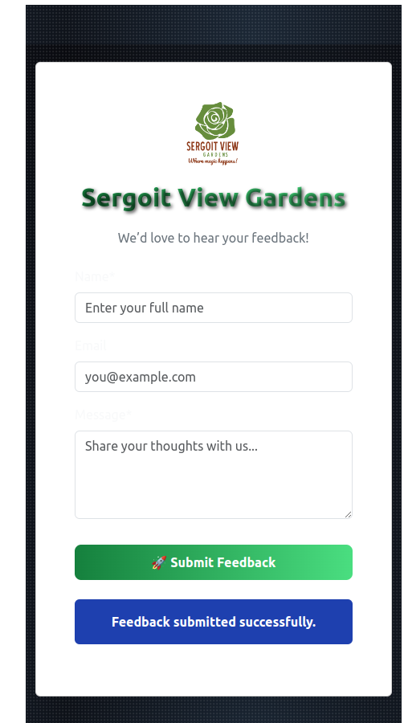

<<<<<<< HEAD
# SergoitFeedbackProject
 A feedback app for Sergoit View Gardens built with React and AWS (Lambda, API Gateway, DynamoDB, SES, SQS, SNS) — real-time guest feedback with email alerts.
=======
#  Sergoit Feedback Portal

An elegant, responsive feedback application for Sergoit View Gardens. Built using **React**, **Bootstrap**, and powered entirely by **AWS Cloud Services** (Lambda, API Gateway, DynamoDB, SQS, SES, SNS).

---

##  Features

-  **Feedback Submission Form** — beautiful UI with galaxy background
-  **DynamoDB** stores guest feedback with timestamp and UUID
-  **SQS** queues messages for future workflows
-  **SES** sends thank-you emails to users and admin alerts
-  **SNS** notifies subscribed admin emails instantly
-  CORS-enabled secure public submission
-  Responsive design, animations, and branding for real users

---

##  UI Preview

 

> An elegant feedback form with galaxy background, logo branding, and a glowing confirmation effect.

---

## Example Emails

-  **User receives**: A "Thank you for your feedback!" confirmation
-  **Admin receives**: A "New Feedback Submitted" alert with name, message, and timestamp
-  **SNS Topic**: Broadcasts every submission to a subscribed admin email address

---

##  Use Case

This application is deployed at **Sergoit View Gardens** to collect real-time guest feedback. It helps the team:

- Understand guest experience
- Respond quickly to feedback
- Store insights securely
- Automate notifications and tracking

---

## 🔧 Tech Stack

| Layer        | Tech Used                      |
|--------------|--------------------------------|
| Frontend     | React, Bootstrap, CSS          |
| Backend      | AWS Lambda (Python)            |
| API Gateway  | AWS API Gateway                |
| Database     | DynamoDB                       |
| Messaging    | Amazon SQS                     |
| Email        | Amazon SES                     |
| Notification | Amazon SNS                     |

---

##  Project Structure


---

##  Security & Access

- ✅ CORS configured for frontend communication
- ✅ IAM roles follow least privilege principle
- ✅ SES is in sandbox — tested with verified emails
- ✅ Unique IDs (UUID) for all feedback entries
- ✅ Input validation for name, email, and message
  ✅ Fully CORS-compliant API for public web usage


---

## 🧪 How It Works

1. User fills the feedback form and submits
2. API Gateway routes request to AWS Lambda
3. Lambda:
   - Stores data in DynamoDB
   - Sends message to SQS
   - Sends confirmation email via SES
   - Publishes SNS notification
4. Admin is notified and data is saved for review

---

##  Setup Instructions

### Prerequisites

- Node.js & npm
- AWS CLI (configured)
- Verified SES email (sandbox mode)

### Frontend

```bash
git clone https://github.com/Sharonjep/SergoitFeedbackProject.git
cd sergoit-feedback-vite
npm install
npm run dev


---

Let me know if you'd like help customizing the **screenshot path**, **GitHub link**, or **license** section!
>>>>>>> 1c86bd2 (Initial commit - Sergoit Feedback App)
